<!-- =======================================================
                     🌟 CHATHUKA PEHESARA
           FULL-STACK DEVELOPER | AI MODEL DESIGNER
======================================================== -->

   
  
  
  

 

<table align="center">
  <tr>
    <td align="center" width="45%">
      
        
      
    </td>
    <td align="left" width="55%">
      <h3> 👋 Welcome to my Digital Workspace
      </h3>
      

      
I am <b>Chathuka Pehesara</b>, a forward-thinking <b>Full-Stack Developer</b> and <b>AI Designer</b>. My goal is to bridge the gap between complex machine learning architectures and intuitive[...]

      
Currently pursuing my BSc in <b>Artificial Intelligence</b> at SLIIT, I specialize in building scalable applications that solve real-world problems with data-driven precision.

      

      <ul>
        <li>🔭 <b>Working on:</b> Advanced Biosafety AI & Neural Pattern Recognition</li>
        <li>🌱 <b>Learning:</b> Cloud Infrastructure (AWS) & Generative AI</li>
        <li>💬 <b>Ask me about:</b> React, TensorFlow, or why the UI design matters</li>
        <li>⚡ <b>Motto:</b> "Code with purpose, design with empathy."</li>
      </ul>
    </td>
  </tr>
</table>

 

---

<h2 align="center">🚀 My Professional Ecosystem</h2>

  

 

  
  
  
  

---
<h2>💎 Featured projects </h2>

 

---

<h2 align="center">📊 Data-Driven Insight</h2>

  <!-- Replaced third-party streak/activity widgets with GitHub's native contributions image to avoid external API failures -->
  

---

<h2 align="center">🌐 Build Something Together</h2>

  
  &nbsp;
  

  
🎓 <b>BSc (Hons) in Artificial Intelligence</b>

  
Sri Lanka Institute of Information Technology (SLIIT) • 2024-2028

---

  

