<!-- =======================================================
                     CHATHUKA PEHESARA
           FULL-STACK DEVELOPER · AI MODEL DESIGNER
======================================================== -->

   
  
  
  

 

## `0x00` &nbsp; About the Hex Man

<table>
<tr>
<td width="55%" valign="top">

I'm **Chathuka Pehesara** — a full-stack developer and AI designer who thinks in **hex**: hexagonal systems, hexadecimal palettes, and the six-sided logic of good architecture. I bridge dense machine-learning models and interfaces people actually want to use.

Currently reading for a **BSc (Hons) in Artificial Intelligence** at SLIIT, I build applications that turn data-driven precision into something usable.

- 🔭 **Building:** a biosafety AI classifier + a neural-pattern visual toolkit
- 🌱 **Learning:** AWS cloud infrastructure & generative AI
- 💬 **Ask me about:** React, TensorFlow, or why the UI details matter
- ⚡ **Motto:** *"Code with purpose, design with empathy."*

</td>
<td width="45%" valign="top">

</td>
</tr>
</table>

---

## `0x01` &nbsp; Professional Ecosystem

  

 

  
  
  
  

---

## `0x02` &nbsp; Featured Builds

Four builds, one hex grid — statuses and progress bars update as each one moves along.

---

## `0x03` &nbsp; Data-Driven Insight

  
  

 

  

 

  

---

## `0x04` &nbsp; Now Loading...

Hood up, headphones on, screen glow doing the rest — the Hex Man at work.

---

## `0x05` &nbsp; Build Something Together

  
  &nbsp;
  

  
🎓 <b>BSc (Hons) in Artificial Intelligence</b>

  
Sri Lanka Institute of Information Technology (SLIIT) · 2024–2028

---

  

